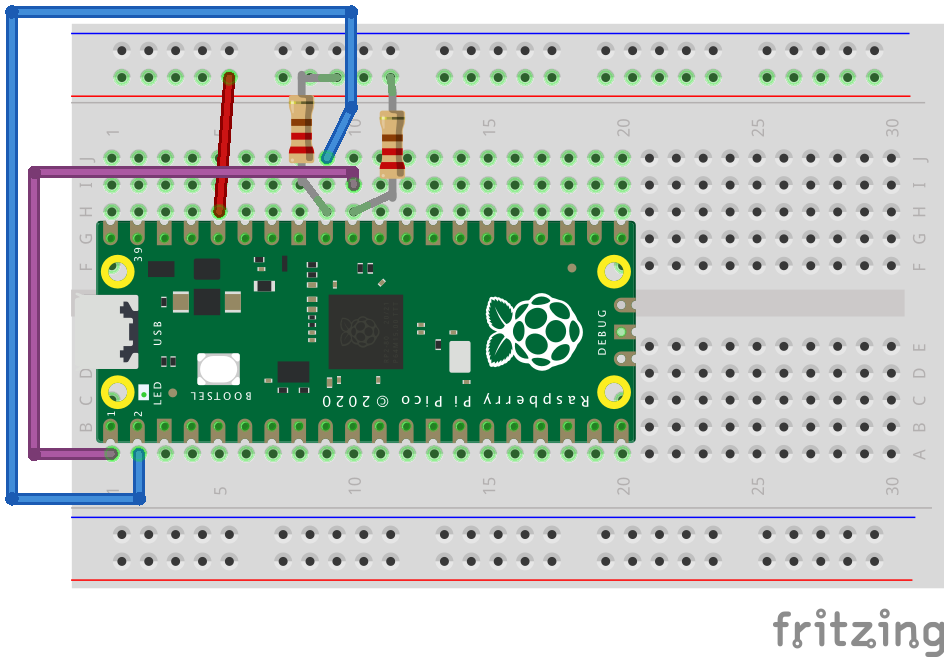

# Try out LLDB debugging on Raspberry Pi Pico
Try out LLDB hardware debugging features for Swift Embedded on Raspberry Pi Pico (RP2040/RP2350) boards

In this guide, we’ll build a sample I2C embedded app for a **Raspberry Pi RP2040 / RP2350 board**, containing a few bugs. Then, we’ll use LLDB to identify and fix them.

To debug the board, you will use a hardware debugger together with software running on your computer. The hardware debugger connects to the board’s debug pins and gives your computer low-level access to the microcontroller while it is running. LLDB connects to your board and lets you pause the program, inspect its state, and step through the code to find problems. For this, you will need software that communicates with the hardware debugger and provides a debug interface that LLDB can use, such as OpenOCD.

## Prerequisites
- Install **Swift with Embedded support**, **LLDB**, and **SVD2LLDB** (instructions below)
- A Raspberry Pi **RP2350 / RP2040**-based board with access to SWD (debug) pins, and an LED. On-board LEDs may be used as long as they are connected directly to GPIO; otherwise, you may use an external LED.
- A **SWD / JTAG hardware debugger**, allowing GDB remote debug protocol connections via software such as *OpenOCD*.

> Note: If you have another RP2350 / RP2040 board or a Raspberry Pi Debug Probe, you can use it for debugging, via OpenOCD.


### Installing Swift, LLDB and SVD2LLDB

To install Swift for embedded development, follow the instructions in <doc:InstallEmbeddedSwift>, which guides you through using swiftly to install the latest development snapshot with Embedded Swift support. The toolchain includes the LLDB Debugger, so you don't need to install it separately.

To install SVD2LLDB, which is an LLDB plugin that enhances firmware debugging by providing semantic access to hardware registers, follow the instructions [in the swift-mmio docs](https://swiftpackageindex.com/apple/swift-mmio/documentation/svd2lldb/buildingsvd2lldb).

If you're new to LLDB, apart from this guide, we also recommend you check out [the related WWDC sessions](https://developer.apple.com/videos/play/wwdc2022/110370), and the [LLDB docs](https://lldb.llvm.org).

## Building the embedded app
Download the starter app project from the [swift-embedded-examples repository](https://github.com/swiftlang/swift-embedded-examples/tree/main/rpi-pico-lldb/). The `start-tutorial` folder contains the starting point for this tutorial, and the `finished-tutorial` folder contains an example of a completed, fixed project.

After opening `start-tutorial`, build your app:
```shell
$ cd rpi-pico-lldb/start-tutorial; make BOARD=RP2040 // or BOARD=RP2350
```

Build files, including an `Application` Mach-O binary, and the `Application.uf2` will be written to the `.build` directory:

```shell
$ ls -lh .build/armv7em-apple-none-macho/debug | grep Application 
-rwxr-xr-x@  1 cmd  staff   342K Jan  9  9:41 Application
-rw-r--r--@  1 cmd  staff    40K Jan  9  9:41 Application.bin
drwxr-xr-x@ 13 cmd  staff   416B Jan  9  9:41 Application.build
-rw-r--r--@  1 cmd  staff   340K Jan  9  9:41 Application.disassembly
-rw-r--r--@  1 cmd  staff   1.7M Jan  9  9:41 Application.mangled.map
-rw-r--r--@  1 cmd  staff   2.1M Jan  9  9:41 Application.map
drwxr-xr-x@  3 cmd  staff    96B Jan  9  9:41 Application.product
-rw-r--r--@  1 cmd  staff    81K Jan  9  9:41 Application.uf2
```

Before moving on, feel free to take a look at the source code of this project. It is a simple example in which an I2C device, represented by the Pico's `i2c0` interface, is connected to a hypothetical, special I2C peripheral memory, emulated by the `i2c1` interface:

```swift
@main
struct Application {
  static func main() {
    enableInterfaces()
    let controller = I2CController(I2C0_SCL: I2C0_SCL, I2C0_SDA: I2C0_SDA)
    let memory = MemoryI2CDevice(I2C1_SCL: I2C1_SCL, I2C1_SDA: I2C1_SDA)

    // We first save a byte in our I2C memory.
    // Then, we read the saved byte, to check that everything works.

    // Configure I2C target (address of memory)
    controller.configBus(targetPeripheral: 0x43)

    // Controller sends byte to I2C memory
    let txByte: UInt8 = 0xA5
    controller.writeByte(txByte)

    // Memory I2C peripheral reads & saves byte, incremented
    memory.receiveBytesToMemory()

    // Controller requests byte from I2C Memory
    controller.requestByteFromMemory()

    // Memory serves the incremented byte
    memory.serveBytesFromMemory()

    // Controller receives the byte
    let readValue = controller.receiveRequestedBytesFromMemory()

    // Validate the transmission
    if readValue != nil && readValue! == txByte + 1 {
      ledSuccess()
    } else {
      blinkFailForever(2)
    }
  }
}
```

Our special memory increments each value that is saved to it.

## Initial board setup
For this tutorial you will have to connect the `i2c0` and `i2c1` interfaces' `SDA` and `SCL` pins. Use of external pull-ups is recommended.

An example Fritzing schematic for the Raspberry Pi Pico / Pico 2 is provided below:



If you are using another RP2040 / RP2350 board, or different pins, you may need to [change the I2C pin numbers in the Application.swift source file](https://github.com/swiftlang/swift-embedded-examples/blob/main/rpi-pico-lldb/start-tutorial/Sources/Application/Application.swift).

After you made the connections above, connect a debugger to the board's SWD pins. Refer to your hardware debugger's documentation for more info.

> Note: If you have another Pico or a Raspberry Pi Debug probe, you can use it for debugging. Check out Raspberry Pi's [docs](https://www.raspberrypi.com/documentation/microcontrollers/debug-probe.html) and [picoprobe GitHub repo](https://github.com/raspberrypi/debugprobe) in order to set up the debugger.

## Uploading the firmware
It's time to run & debug the application.

Connect the Raspberry Pi Pico board via a USB cable to your Mac, and make sure it's in the USB Mass Storage firmware upload mode. This is done by *holding the BOOTSEL button while plugging in the board*.

The Pico should then show up as a mounted volume in /Volumes (usually as RPI-RP2 or RP2350):

```shell
$ ls -alh /Volumes
lrwxr-xr-x   1 root  wheel      1 Jan  9  9:41 Macintosh HD -> /
drwx------@  1 cmd   staff    16K Jan  9  2007 RP2350
```

Copy the UF2 file to this volume, either by dragging `Application.uf2` to the new mounted device in Finder or via terminal:

```shell
$ cp .build/armv7em-apple-none-macho/debug/Application.uf2 /Volumes/RP2350
```

Copying in the UF2 file causes the Pico to automatically install the firmware, reboot itself, and run the firmware.
The firmware you uploaded is saved in RAM rather than Flash, so if you unplug your board, the RAM is cleared and your program lost.
In that case, you will need to repeat this process to reflash it.

## Attaching LLDB

In order to use LLDB, connect it to your board. This is done using a hardware SWD debugger and a compatible debug server program, such as OpenOCD.

### Using OpenOCD
If your hardware SWD debugger is supported, you can use OpenOCD as a bridge between LLDB and your board.

OpenOCD is a program that connects to your hardware debugger, providing an interface that LLDB uses to connect and control your board.

> Note: OpenOCD had a bug which may have prevented LLDB from connecting to your board. Ensure you are using the latest version available.

Use two terminals to set up debugging.
For Pico-based debug probes that use Raspberry Pi's OpenOCD port, run the following command in one of the terminals:

```shell
$ sudo src/openocd -s tcl -f interface/cmsis-dap.cfg -f target/rp2350.cfg -c "adapter speed 5000" -c 'gdb_memory_map disable'
Open On-Chip Debugger 0.12.0
Licensed under GNU GPL v2
For bug reports, read
	http://openocd.org/doc/doxygen/bugs.html
Info : Hardware thread awareness created
Info : Hardware thread awareness created
ocd_process_reset_inner
adapter speed: 5000 kHz

Info : Listening on port 6666 for tcl connections
Info : Listening on port 4444 for telnet connections
Info : Using CMSIS-DAPv2 interface with VID:PID=0x2e8a:0x000c, serial=E6614103E724342F
Info : CMSIS-DAP: SWD supported
Info : CMSIS-DAP: Atomic commands supported
Info : CMSIS-DAP: Test domain timer supported
Info : CMSIS-DAP: FW Version = 2.0.0
Info : CMSIS-DAP: Interface Initialised (SWD)
Info : SWCLK/TCK = 0 SWDIO/TMS = 0 TDI = 0 TDO = 0 nTRST = 0 nRESET = 0
Info : CMSIS-DAP: Interface ready
Info : clock speed 5000 kHz
Info : SWD DPIDR 0x4c013477
Info : [rp2350.cm0] Cortex-M33 r1p0 processor detected
Info : [rp2350.cm0] target has 8 breakpoints, 4 watchpoints
Info : [rp2350.cm1] Cortex-M33 r1p0 processor detected
Info : [rp2350.cm1] target has 8 breakpoints, 4 watchpoints
Info : starting gdb server for rp2350.cm0 on 3333
Info : Listening on port 3333 for gdb connections
```

You now have a debug server running on your machine. Leave this terminal open, and do not close the program while you use `lldb` in another terminal.

### Connecting LLDB to your debug server
Run lldb with your `Application` Mach-O and connect to your debug server (here you are connecting to the OpenOCD server's port, `3333`, as seen in the previous section).

```shell
$ lldb .build/armv7em-apple-none-macho/debug/Application
(lldb) target create "/Users/cmd/swift-embedded-examples/rpi-pico2-lldb/start-tutorial/.build/armv7em-apple-none-macho/debug/Application"
Current executable set to '/Users/cmd/swift-embedded-examples/rpi-pico2-lldb/start-tutorial/.build/armv7em-apple-none-macho/debug/Application' (armv7em).
(lldb) gdb-remote 3333
Process 1 stopped
* thread #1, stop reason = signal SIGINT
    frame #0: 0x200053fe Application`interrupt at Support.c:92:3
   89  	}
   90  	
   91  	void interrupt(void) {
-> 92  	  while (1) {}
   93  	}
   94  	
   95  	__attribute((section("__DATA,stack"), aligned(32)))
Target 0: (Application) stopped.
```

You are now connected!
If you are seeing assembly output rather than Swift / C code, make sure you provided the correct Mach-O path to LLDB.
If you did, then it's worth noting that the Raspberry Pi Pico has 2 cores, exposed to LLDB as 2 threads, and our current example runs on one of them only.
The `thread sel` command can be used to select the board's core:

```shell
(lldb) thread sel 2
* thread #2
    frame #0: 0x000000da
->  0xda: ldr    r0, [r4, #0x50]
    0xdc: lsrs   r0, r0, #0x1
    0xde: blo    0xd8
    0xe0: ldr    r0, [r4, #0x58]
(lldb) thread sel 1
* thread #1, stop reason = signal SIGINT
    frame #0: 0x200053fe Application`interrupt at Support.c:92:3
   89  	}
   90  	
   91  	void interrupt(void) {
-> 92  	  while (1) {}
   93  	}
   94  	
   95  	__attribute((section("__DATA,stack"), aligned(32)))
(lldb)  
```

The core that isn’t used by our code is currently idling in the chip's own bootloader (ROM) code.
LLDB doesn't have symbols for the board's ROM, so it can only display the raw assembly instructions.

Otherwise, if you're seeing assembly code in both cases, you might be looking at the board's bootloader (that is, its ROM) code.
You may not have reached the Swift code yet.
A simple way to check this is by looking at the current instruction's address - on RP2040/RP2350, the Boot ROM is memory-mapped starting at `0x00000000`, so any address in the low `0x0000xxxx` range is typically inside the bootloader.
Type `continue` and check that your board isn't waiting for firmware upload (check that it doesn't show up as a mounted volume in `/Volumes`).
Then, type `process-interrupt` or hit Control + C (`^C`) to interrupt the program.

## Finding bugs with LLDB

It is time to find the bugs. If you take a look at the sample application, you will notice that it is supposed to reach an on-board LED-blinking stage; however, you are likely not seeing any turned on LED.

### Uncovering the first issue

Find out where the code stopped by checking the backtrace with `thread backtrace` / `bt`:

```shell
* thread #1, stop reason = signal SIGINT
    frame #0: 0x200053fe Application`interrupt at Support.c:92:3
   89  	}
   90  	
   91  	void interrupt(void) {
-> 92  	  while (1) {}
   93  	}
   94  	
   95  	__attribute((section("__DATA,stack"), aligned(32)))
(lldb) bt
* thread #1, stop reason = signal SIGINT
  * frame #0: 0x200053fe Application`interrupt at Support.c:92:3
    frame #1: 0x20000dba Application`Swift._assertionFailure(_: Swift.StaticString, _: Swift.StaticString, file: Swift.StaticString, line: Swift.UInt, flags: Swift.UInt32) -> Swift.Never at <compiler-generated>:0
    frame #2: 0x20003c9a Application`generic specialization <RP2350.PADS_BANK0.GPIO, Swift.UInt32> of MMIO.RegisterArray<τ_0_0 where τ_0_0: MMIO.RegisterValue>.subscript.getter : <τ_0_0 where τ_1_0: Swift.BinaryInteger>(τ_1_0) -> MMIO.Register<τ_0_0> at RegisterArray.swift:174:5
    frame #3: 0x20003b72 Application`Application.configureLedPinSIO(Swift.UInt32) -> () at OnboardLED.swift:21:18
    frame #4: 0x20000968 Application`Application.enableInterfaces() -> () at Application.swift:80:5
    frame #5: 0x20000bbc Application`static Application.Application.main() -> () at Application.swift:93:5
    frame #6: 0x20000d6c Application`static Application.Application.$main() -> () at <compiler-generated>:0
    frame #7: 0x20000d78 Application`Application_main at Application.swift:0
    frame #8: 0x200053ee Application`reset at Support.c:87:19
    frame #9: 0x000002f4
```

This looks like an assertion failure.
The code is now in an infinite `interrupt()` loop.
Frame `#1` is our assertion failure, and frame `#2` seems to be related to Swift MMIO.
Meanwhile, from frame `#3` onwards, function calls are related to our Application code itself.

> `interrupt()` serves as a fault handler, since the relevant vector table entries point to it. The vector table is defined in `Support.c`.

To see where the code stopped inside Swift MMIO, in frame `#2`, use `frame select <frame_number>`:
```shell
(lldb) frame sel 2
frame #2: 0x20003c9a Application`generic specialization <RP2350.PADS_BANK0.GPIO, Swift.UInt32> of MMIO.RegisterArray<τ_0_0 where τ_0_0: MMIO.RegisterValue>.subscript.getter : <τ_0_0 where τ_1_0: Swift.BinaryInteger>(τ_1_0) -> MMIO.Register<τ_0_0> at RegisterArray.swift:174:5
   171 	  ) -> Register<Value> where Index: BinaryInteger {
   172 	    #if hasFeature(Embedded)
   173 	    // FIXME: Embedded doesn't have static interpolated strings yet
-> 174 	    precondition(
   175 	      0 <= index && index < self.count,
   176 	      "Index out of bounds")
   177 	    #else
```

It appears that the code has an out of bounds issue.
Fortunately, Swift MMIO has captured it, resulting in an assertion failure rather than a segmentation fault.

Find what triggered this issue by looking at the frames related to the Application code:

```shell
(lldb) frame sel 3
frame #3: 0x20003b72 Application`Application.configureLedPinSIO(Swift.UInt32) -> () at OnboardLED.swift:21:18
   18  	// GPIO config (LED via SIO)
   19  	func configureLedPinSIO(_ pin: UInt32) {
   20  	  // Pad electrical properties
-> 21  	  pads_bank0.gpio[pin].modify { rw in
   22  	    rw.raw.od = 0        // outputs enabled
   23  	    rw.raw.ie = 0        // input disabled
   24  	    rw.raw.pue = 0       // no pull-up
(lldb) frame sel 4
frame #4: 0x20000968 Application`Application.enableInterfaces() -> () at Application.swift:80:5
   77  	    while resets.reset_done.read().raw.i2c1 == 0 {}
   78  	
   79  	    // LED pin init
-> 80  	    configureLedPinSIO(LED_PIN)
   81  	    ledSet(false)
   82  	
   83  	    // I2C pins config
(lldb) frame sel 5
frame #5: 0x20000bbc Application`static Application.Application.main() -> () at Application.swift:93:5
   90  	@main
   91  	struct Application {
   92  	  static func main() {
-> 93  	    enableInterfaces()
   94  	    let controller = I2CController(I2C0_SCL: I2C0_SCL, I2C0_SDA: I2C0_SDA)
   95  	    let memory = MemoryI2CDevice(I2C1_SCL: I2C1_SCL, I2C1_SDA: I2C1_SDA)
   96  	
(lldb)
```

Looking at the source code, you can see in frame 5 that we were trying to enable our board's relevant interfaces, such as I2C. Frame 3 and 4 suggest that the incorrect out-of-bounds access takes place when the LED's pin is configured. Specifically, `pads_bank0.gpio[pin]` fails, likely due to an incorrect pin number.

Searching the codebase for `LED_PIN`, you can see that it is initialized with `100`:

```swift
// Board LED
LED_PIN: UInt32 = 100
```

The Raspberry Pi Pico has only 40 physical pins, including 26 GPIO; `100` is an odd, incorrect choice for the LED pin number.
You will need to change this to your board's correct on-board LED GPIO number, or an external GPIO number of your choice if you'd rather prefer using an external LED (or if the board doesn't provide a simple on-board LED directly tied to GPIO).

After making this change, re-build the firmware.

### Setting a breakpoint on our app's entrypoint
After building the firmware, it's time to re-flash it.

This time, try to set up a breakpoint to `static Application.Application.main()`.
This helps in certain scenarios, when you don't want to start running code directly, but rather stop at certain instructions.

Re-connect the board to the computer, while holding `BOOTSEL`, and attach the OpenOCD debugger. Before uploading the `Application.uf2` to the mounted volume, re-start lldb with the new binary, and set a breakpoint:

```shell
$ lldb .build/armv7em-apple-none-macho/debug/Application
(lldb) target create "/Users/cmd/swift-embedded-examples/rpi-pico2-lldb/start-tutorial/.build/armv7em-apple-none-macho/debug/Application"
Current executable set to '/Users/cmd/swift-embedded-examples/rpi-pico2-lldb/start-tutorial/.build/armv7em-apple-none-macho/debug/Application' (armv7em)
(lldb) breakpoint set --hardware -n main 
Breakpoint 1: 2 locations.
(lldb) br list
Current breakpoints:
1: name = 'main', locations = 2, resolved = 2, hit count = 0
  1.1: where = Application`static Application.main() + 24 at Application.swift:93:5, address = 0x20000bb8, resolved, hardware, hit count = 0 
  1.2: where = Application`Application_main at Application.swift, address = 0x20000d70, resolved, hardware, hit count = 0 

(lldb)
```

After that, attach LLDB to OpenOCD's debug port:
```shell
(lldb) gdb-remote 3333
Process 1 stopped
* thread #1, stop reason = signal SIGINT
    frame #0: 0x00000000
->  0x0: movs   r0, r0
    0x2: and    r0, r0, #0x89
    0x6: movs   r0, r0
    0x8: lsls   r1, r7, #0xb
Target 0: (Application) stopped.
(lldb) continue
```

Notice that the application stopped in the board's bootloader code (based on the current instruction's address). Type `continue` to let the bootloader run.

Then, upload the `UF2` firmware to the new mounted volume.

> Note: There are other ways to upload the binary as well. For example, you can also copy the binary directly over SWD, rather than manually uploading it via the mounted volume.

Right after uploading the firmware, you will reach your entrypoint breakpoints:

```shell
(lldb) continue
Process 1 resuming
[rp2350.cm0] external reset detected
[rp2350.cm1] external reset detected
Process 1 stopped
* thread #1, stop reason = breakpoint 1.2
    frame #0: 0x20000d70 Application`Application_main at Application.swift:0
-> 1   	//===----------------------------------------------------------------------===//
   2   	//
   3   	// This source file is part of the Swift open source project
   4   	//
   5   	// Copyright (c) 2024 Apple Inc. and the Swift project authors.
   6   	// Licensed under Apache License v2.0 with Runtime Library Exception
   7   	//
note: This address is not associated with a specific line of code. This may be due to compiler optimizations.
Target 0: (Application) stopped.
(lldb) continue
Process 1 resuming
Process 1 stopped
* thread #1, stop reason = breakpoint 1.1
    frame #0: 0x20000bb8 Application`static Application.main() at Application.swift:93:5
   90  	@main
   91  	struct Application {
   92  	  static func main() {
-> 93  	    enableInterfaces()
   94  	    let controller = I2CController(I2C0_SCL: I2C0_SCL, I2C0_SDA: I2C0_SDA)
   95  	    let memory = MemoryI2CDevice(I2C1_SCL: I2C1_SCL, I2C1_SDA: I2C1_SDA)
   96  	
Target 0: (Application) stopped.
(lldb)  
```

### Investigating the second bug
Turn your attention to the second bug. If you type `continue`, you will notice that your code doesn't crash, but the LED isn't on, so something is still not right. The code is likely hanging somewhere.

Interrupt the code with Control + C (`^C`) or `process interrupt`:

```shell
(lldb) continue
Process 1 resuming
(lldb) process interrupt
Process 1 stopped
* thread #2, stop reason = signal SIGINT
    frame #0: 0x000000da
->  0xda: ldr    r0, [r4, #0x50]
    0xdc: lsrs   r0, r0, #0x1
    0xde: blo    0xd8
    0xe0: ldr    r0, [r4, #0x58]
Target 0: (Application) stopped.
(lldb) thread sel 1
* thread #1
    frame #0: 0x20002dce Application`generic specialization <serialized, RP2350.I2C0.IC_STATUS> of MMIO.Register.init(unsafeAddress: Swift.UInt) -> MMIO.Register<τ_0_0> at <compiler-generated>:0
note: This address is not associated with a specific line of code. This may be due to compiler optimizations.
(lldb) bt
* thread #1
  * frame #0: 0x20002dce Application`generic specialization <serialized, RP2350.I2C0.IC_STATUS> of MMIO.Register.init(unsafeAddress: Swift.UInt) -> MMIO.Register<τ_0_0> at <compiler-generated>:0
    frame #1: 0x200048de Application`RP2350.I2C0.ic_status.getter : MMIO.Register<RP2350.I2C0.IC_STATUS> at @__swiftmacro_6RP23504I2C0V9ic_status13RegisterBlockfMa_.swift:6:15
    frame #2: 0x200031dc Application`closure #1 () -> Swift.Bool in Application.MemoryI2CDevice.receiveBytesToMemory() -> () at MemoryI2CDevice.swift:60:18
    frame #3: 0x200022ec Application`Application.waitForCondition(() -> Swift.Bool) -> () at I2C.swift:42:8
    frame #4: 0x20003194 Application`Application.MemoryI2CDevice.receiveBytesToMemory() -> () at MemoryI2CDevice.swift:59:9
    frame #5: 0x20000c18 Application`static Application.Application.main() -> () at Application.swift:108:12
    frame #6: 0x20000d6c Application`static Application.Application.$main() -> () at <compiler-generated>:0
    frame #7: 0x20000d78 Application`Application_main at Application.swift:0
    frame #8: 0x200053f6 Application`reset at Support.c:87:19
    frame #9: 0x000002f4
(lldb) frame sel 3
frame #3: 0x200022ec Application`Application.waitForCondition(() -> Swift.Bool) -> () at I2C.swift:42:8
   39  	@inline(__always)
   40  	func waitForCondition(_ cond: () -> Bool) {
   41  	  while true {
-> 42  	    if cond() { return }
   43  	    nop()
   44  	  }
   45  	}
```

> Note: This time, when interrupting the program, you may end up stopping at a different place, since the board is continuously looping over some instructions. However, from the third frame 3 onwards, everything should look similar.

It seems that the debugger stopped in an I2C-related code.
Looking at frame 3, you can see that it is waiting for a condition inside `MemoryI2CDevice.swift`.
And, by looking at frame `#4`, you can see that the `i2c1` memory peripheral is trying to receive bytes to memory (`Application.MemoryI2CDevice.receiveBytesToMemory()`).

You can conclude that somewhere, the `I2C` transmission (between the host `i2c0` and the emulated memory device `i2c1`) hangs.
Now it's a good time to try SVD2LLDB's features.
Provided that you installed it, load the `SVD` file in the `swift-embedded-examples` repository:

```shell
(lldb) svd load path/to/swift-embedded-examples/Tools/SVDs/rp235x.patched.svd // or rp2040 equivalent
Loaded SVD file: “rp235x.patched.svd”.
(lldb)
```

> Note: An SVD file (System View Description) is an XML description of a microcontroller’s peripherals and registers. Debugging tools like SVD2LLDB and Swift MMIO use them to show named register fields and memory-mapped I/O in a human-friendly way.

Inspect the configured I2C addresses by looking at the relevant registers (the one to which `i2c0` writes, and the one on which `i2c1` is listening):
```shell
(lldb) svd info i2c0.ic_tar
I2C0.IC_TAR:
  Description:                     Note: If the software or application is aware that the DW_apb_i2c is not using the TAR address for the pending commands in the Tx FIFO, then it is possible to update the TAR address even while the Tx FIFO has entries (IC_STATUS[2]= 0). - It is not necessary to perform any write to this register if DW_apb_i2c is enabled as an I2C slave only.
  Address:     0x0000_0000_4009_0004
  Bit Width:   32
  Reset Value: 0x0000_0055
  Reset Mask:  0xffff_ffff
  Fields:      [SPECIAL, GC_OR_START, IC_TAR]
(lldb) svd info i2c1.ic_sar
I2C1.IC_SAR:
  Description: I2C Slave Address Register
  Address:     0x0000_0000_4009_8008
  Bit Width:   32
  Reset Value: 0x0000_0055
  Reset Mask:  0xffff_ffff
  Fields:      [IC_SAR]
(lldb) 
```

Use the `svd read` command to read these registers:
```shell
(lldb) svd read i2c0.ic_tar
RP2350:
  I2C0:
    IC_TAR: 0x0000_0043
(lldb) svd read i2c1.ic_sar
RP2350:
  I2C1:
    IC_SAR: 0x0000_0055
```

You can clearly see a difference here:  `i2c0`'s target address is `0x43`, while `i2c1` is holding its reset value, `0x55`.
Now it's a good idea to check what value `i2c1` is supposed to be listening on, by looking in `MemoryI2CDevice.swift`:

```swift
    // Set peripheral address
    i2c1.ic_sar.write { w in
        w.storage = 0x42
    }
```

It seems that `i2c1` is supposed to be listening on `0x42`. Therefore, part of the issue may be caused by the mismatch between the `i2c0`'s target address `0x43`, and `i2c1`'s listening address, which is supposed to be `0x42`. However, as previously mentioned, `i2c1` is currently set to `0x55`, so another bug might be present.

Before moving on to the last bug, change the I2C target address to `0x42` in `Application.swift`:
```swift
    // Configure I2C target (address of memory)
    controller.configBus(targetPeripheral: 0x42)
```

Alternatively, change the `i2c1`'s address to `0x43`, or change both addresses to a value of your choice.

Then re-build, and follow the same firmware flashing steps.

### Finding and fixing the last bug
If you change the target address, the behavior is unchanged:

```shell
(lldb) thread sel 1
* thread #1
    frame #0: 0x20001b88 Application`generic specialization <Swift.UnsafeMutablePointer<Swift.UInt32>> of Swift.Optional.unsafelyUnwrapped.getter : τ_0_0 at <compiler-generated>:0
note: This address is not associated with a specific line of code. This may be due to compiler optimizations.
(lldb) bt
* thread #1
  * frame #0: 0x20001b88 Application`generic specialization <Swift.UnsafeMutablePointer<Swift.UInt32>> of Swift.Optional.unsafelyUnwrapped.getter : τ_0_0 at <compiler-generated>:0
    frame #1: 0x200019e2 Application`generic specialization <RP2350.I2C0.IC_STATUS> of MMIO.Register.pointer.getter : Swift.UnsafeMutablePointer<τ_0_0.Raw.Storage> at Register.swift:180:43
    frame #2: 0x20000ae8 Application`generic specialization <RP2350.I2C0.IC_STATUS> of MMIO.Register.read() -> τ_0_0.Read at Register.swift:216:49
    frame #3: 0x200031e0 Application`closure #1 () -> Swift.Bool in Application.MemoryI2CDevice.receiveBytesToMemory() -> () at MemoryI2CDevice.swift:60:28
    frame #4: 0x200022ec Application`Application.waitForCondition(() -> Swift.Bool) -> () at I2C.swift:42:8
    frame #5: 0x20003194 Application`Application.MemoryI2CDevice.receiveBytesToMemory() -> () at MemoryI2CDevice.swift:59:9
    frame #6: 0x20000c18 Application`static Application.Application.main() -> () at Application.swift:108:12
    frame #7: 0x20000d6c Application`static Application.Application.$main() -> () at <compiler-generated>:0
    frame #8: 0x20000d78 Application`Application_main at Application.swift:0
    frame #9: 0x200053f6 Application`reset at Support.c:87:19
    frame #10: 0x000002f4
(lldb) svd load /Users/cmd/Downloads/swift-embedded-examples/Tools/SVDs/rp235x.patched.svd
Loaded SVD file: “rp235x.patched.svd”.
(lldb) svd read i2c0.ic_tar                                                                                                                                                                    RP2350:
  I2C0:
    IC_TAR: 0x0000_0042
(lldb) svd read i2c1.ic_sar
RP2350:
  I2C1:
    IC_SAR: 0x0000_0055
```

Earlier the article mentioned there may be more than one issue.
It's now time to check out other relevant I2C MMIO registers.

At this stage, look at your board's datasheet ([RP2040 datasheet - section 4.3.17](https://pip-assets.raspberrypi.com/categories/814-rp2040/documents/RP-008371-DS-1-rp2040-datasheet.pdf) / [RP2350 datasheet - section 12.2.17](https://pip-assets.raspberrypi.com/categories/1214-rp2350/documents/RP-008373-DS-2-rp2350-datasheet.pdf)).

Find `IC_CON`, the I2C Control Register.
This is main register responsible for the I2C interface configuration.
It is also the first register in the datasheet's I2C registers list.

```shell
(lldb) svd info i2c0.IC_CON
I2C0.IC_CON:
  Description:                     Read/Write Access: - bit 10 is read only. - bit 11 is read only - bit 16 is read only - bit 17 is read only - bits 18 and 19 are read only.
  Address:     0x0000_0000_4009_0000
  Bit Width:   32
  Reset Value: 0x0000_0065
  Reset Mask:  0xffff_ffff
  Fields:      [STOP_DET_IF_MASTER_ACTIVE, RX_FIFO_FULL_HLD_CTRL, TX_EMPTY_CTRL, STOP_DET_IFADDRESSED, IC_SLAVE_DISABLE, IC_RESTART_EN, IC_10BITADDR_MASTER, IC_10BITADDR_SLAVE, SPEED, MASTER_MODE]
(lldb) svd info i2c1.IC_CON
I2C1.IC_CON:
  Description:                     Read/Write Access: - bit 10 is read only. - bit 11 is read only - bit 16 is read only - bit 17 is read only - bits 18 and 19 are read only.
  Address:     0x0000_0000_4009_8000
  Bit Width:   32
  Reset Value: 0x0000_0065
  Reset Mask:  0xffff_ffff
  Fields:      [STOP_DET_IF_MASTER_ACTIVE, RX_FIFO_FULL_HLD_CTRL, TX_EMPTY_CTRL, STOP_DET_IFADDRESSED, IC_SLAVE_DISABLE, IC_RESTART_EN, IC_10BITADDR_MASTER, IC_10BITADDR_SLAVE, SPEED, MASTER_MODE]
```

Remember that the reset value for these registers is 0x65 - this can help you identify whether the register was modified or is at its default value. This value is also indicated in the datasheet.

Since this is a complex register with multiple fields, it is a great candidate for the `decode` SVD2LLDB command.
With it, you can read the register and display its value in a beautiful, visual way:

```shell
(lldb) svd decode i2c0.IC_CON --read --visual
I2C0.IC_CON: 0x0000_0063

                               ╭╴SPEED
                             ╭╴IC_10BITADDR_MASTER
                           ╭╴IC_SLAVE_DISABLE
                         ╭╴TX_EMPTY_CTRL
                       ╭╴STOP_DET_IF_MASTER_ACTIVE
                       ┴ ┴ ┴ ┴ ┴─
0b00000000000000000000000001100011
                        ┬ ┬ ┬ ┬  ┬
                        ╰╴RX_FIFO_FULL_HLD_CTRL
                          ╰╴STOP_DET_IFADDRESSED
                            ╰╴IC_RESTART_EN
                              ╰╴IC_10BITADDR_SLAVE
                                 ╰╴MASTER_MODE

[10:10] STOP_DET_IF_MASTER_ACTIVE 0x0
[9:9]   RX_FIFO_FULL_HLD_CTRL     0x0 (DISABLED)
[8:8]   TX_EMPTY_CTRL             0x0 (DISABLED)
[7:7]   STOP_DET_IFADDRESSED      0x0 (DISABLED)
[6:6]   IC_SLAVE_DISABLE          0x1 (SLAVE_DISABLED)
[5:5]   IC_RESTART_EN             0x1 (ENABLED)
[4:4]   IC_10BITADDR_MASTER       0x0 (ADDR_7BITS)
[3:3]   IC_10BITADDR_SLAVE        0x0 (ADDR_7BITS)
[2:1]   SPEED                     0x1 (STANDARD)
[0:0]   MASTER_MODE               0x1 (ENABLED)
(lldb) svd decode i2c1.IC_CON --read --visual
I2C1.IC_CON: 0x0000_0065

                               ╭╴SPEED
                             ╭╴IC_10BITADDR_MASTER
                           ╭╴IC_SLAVE_DISABLE
                         ╭╴TX_EMPTY_CTRL
                       ╭╴STOP_DET_IF_MASTER_ACTIVE
                       ┴ ┴ ┴ ┴ ┴─
0b00000000000000000000000001100101
                        ┬ ┬ ┬ ┬  ┬
                        ╰╴RX_FIFO_FULL_HLD_CTRL
                          ╰╴STOP_DET_IFADDRESSED
                            ╰╴IC_RESTART_EN
                              ╰╴IC_10BITADDR_SLAVE
                                 ╰╴MASTER_MODE

[10:10] STOP_DET_IF_MASTER_ACTIVE 0x0
[9:9]   RX_FIFO_FULL_HLD_CTRL     0x0 (DISABLED)
[8:8]   TX_EMPTY_CTRL             0x0 (DISABLED)
[7:7]   STOP_DET_IFADDRESSED      0x0 (DISABLED)
[6:6]   IC_SLAVE_DISABLE          0x1 (SLAVE_DISABLED)
[5:5]   IC_RESTART_EN             0x1 (ENABLED)
[4:4]   IC_10BITADDR_MASTER       0x0 (ADDR_7BITS)
[3:3]   IC_10BITADDR_SLAVE        0x0 (ADDR_7BITS)
[2:1]   SPEED                     0x2 (FAST)
[0:0]   MASTER_MODE               0x1 (ENABLED)
(lldb)
```

> Note: You can also read the register manually using LLDB `memory read` commands, and provide its value as an argument. For more info, run `svd decode --help`.

It seems that the `i2c0` interface is correctly initialized, while the `i2c1` register doesn't seem to be configured at all, containing its reset value.
This is likely why the reading operation stalls.
In order to find out why this is actually happening, take a closer look at `MemoryI2CDevice.swift`, and the function responsible for I2C bus configuration:

```swift
class MemoryI2CDevice {
    ...

    init(I2C1_SCL: UInt32, I2C1_SDA: UInt32, address: UInt32, enableInternalPullUp: Bool) {
        self.address = address
        configureI2CPin(I2C1_SDA, enableInternalPullUp: enableInternalPullUp)
        configureI2CPin(I2C1_SCL, enableInternalPullUp: enableInternalPullUp)
        enableI2C()
        configBus()
    }

    private func enableI2C() {
         i2c1.ic_enable.write { w in w.storage = 1 }
    }

    private func disableI2C() {
         i2c1.ic_enable.write { w in w.storage = 0 }
    }

    private func configBus() {
        // Configure I2C0 as CONTROLLER

        // Config as peripheral
        i2c1.ic_con.write { w in
            w.raw.master_mode = 0
            w.raw.speed = 1
            w.raw.ic_restart_en = 1
            w.raw.ic_slave_disable = 0
        }

        // Set peripheral address
        i2c1.ic_sar.write { w in
            w.storage = address
        }
    }
}
```

At first glance, this code may look reasonable - the I2C bus is enabled, and then configured using `configBus()`.
Set a breakpoint on `configBus` and re-run the app, to see if this write really fails.

> Note: you can re-run the program by either repeating the flashing sequence, or modifying the core's `pc` (program counter) and `sp` (stack pointer) registers to their reset values set in the Vector Table. You do not necessarily need to flash the application again, since it is already in memory.

```
(lldb) break set --hardware --name MemoryI2CDevice.configBus
Breakpoint 5: where = Application`MemoryI2CDevice.configBus() + 18 at MemoryI2CDevice.swift:44:14, address = 0x20003062
[rp2350.cm0] external reset detected
[rp2350.cm1] external reset detected
Process 1 stopped
* thread #1, stop reason = breakpoint 5.1
    frame #0: 0x20003062 Application`Application.MemoryI2CDevice.configBus() -> () at MemoryI2CDevice.swift:43:14
   40  	        // Configure I2C0 as CONTROLLER
   41  	
   42  	        // Config as peripheral
-> 43  	        i2c1.ic_con.write { w in
   44  	            w.raw.master_mode = 0
   45  	            w.raw.speed = 1
   46  	            w.raw.ic_restart_en = 1
(lldb)
```

You have now reached the `configBus()` function. Check the IC_CON value before writing:

```
(lldb) svd read i2c1.ic_con
RP2350:
  I2C1:
    IC_CON: 0x0000_0065
```

Step-over the register write and check if the new values were written:

```
(lldb) next
Process 1 stopped
* thread #1, stop reason = step over
    frame #0: 0x20003080 Application`Application.MemoryI2CDevice.configBus() -> () at MemoryI2CDevice.swift:52:9
   48  	        }
   49  	
   50  	        // Set peripheral address
-> 51  	        i2c1.ic_sar.write { w in
   52  	            w.storage = address
   53  	        }
   54  	    }
Target 0: (Application) stopped.
(lldb) svd read i2c1.ic_con
RP2350:
  I2C1:
    IC_CON: 0x0000_0065
```

You can see that nothing changes. Therefore, the issue relies on this register write - somehow, the value isn't written to the register at all. At this point, it's a good idea to check the datasheet again, asking yourself *"are we writing this wrong?"*.

> IC_CON Register Description, according to the datasheet:
> This register can be written only when the DW_apb_i2c is disabled, which corresponds to the IC_ENABLE[0] register being set to 0. Writes at other times have no effect. 

This must be the problem, since it matches the symptoms! Therefore, it can’t write to the register, since the `i2c1` interface isn’t disabled when you configure it inside `MemoryI2CDevice.swift`:

```swift
    init(I2C1_SCL: UInt32, I2C1_SDA: UInt32, address: UInt32, enableInternalPullUp: Bool) {
        self.address = address
        configureI2CPin(I2C1_SDA, enableInternalPullUp: enableInternalPullUp)
        configureI2CPin(I2C1_SCL, enableInternalPullUp: enableInternalPullUp)
        // ❌ Before
        // enableI2C()
        // configBus()

        // ✅ After
        disableI2C()
        configBus()
        enableI2C()
    }
```

Therefore, you must first call `disableI2C()` before configuring the bus. The host `i2c0` interface already does this in `I2CController.swift`, so that's why it was correctly configured from the beginning.

By applying this last fix, the program should be fully fixed. Hooray!
