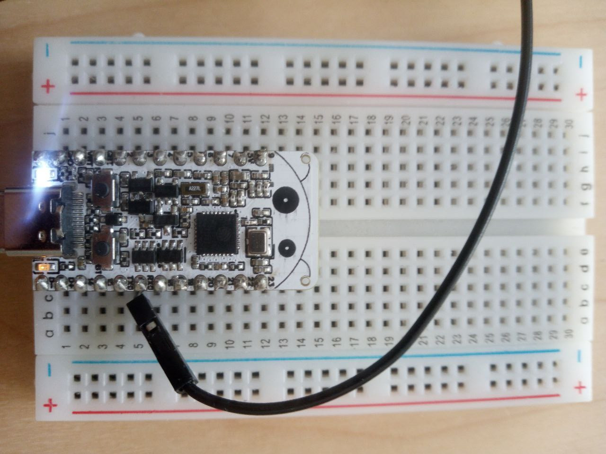
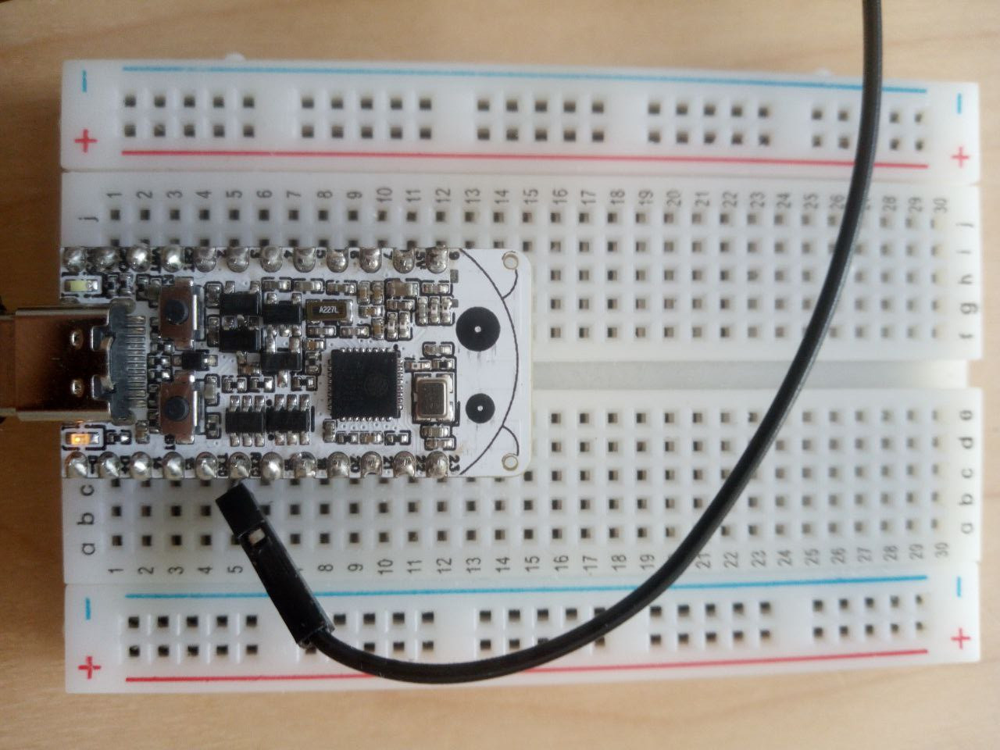

# Blinking an LED on the ESP32

Run a Swift LED-blink program on a RISC-V ESP32 device using the ESP-IDF SDK.

This example demonstrates how to integrate with the ESP-IDF SDK using CMake along with the standard GPIO library to control an LED from Swift. The target is the ESP32-C6-Bug board, which has a built-in LED on GPIO pin 8. Any RISC-V based Espressif chip works.




The Swift code is structured as a thin `Led` struct that wraps the ESP-IDF GPIO API, and an `app_main` entry point — the standard C entry point for ESP-IDF applications — that toggles the LED in an infinite loop:

```swift
@_cdecl("app_main")
func main() {
    let led = Led(gpioPin: 8)
    var ledValue = false
    while true {
        led.setLed(value: ledValue)
        ledValue.toggle()
        vTaskDelay(500 / (1000 / UInt32(configTICK_RATE_HZ)))
    }
}
```

## Install ESP-IDF

Set up the [ESP-IDF](https://docs.espressif.com/projects/esp-idf/en/stable/esp32/) development environment by following the [ESP-IDF "Get Started" guide](https://docs.espressif.com/projects/esp-idf/en/v5.4/esp32c6/get-started/index.html).

> Important: Configure your environment specifically for RISC-V based Espressif chips. Embedded Swift doesn't support Xtensa-based products.

Before adding Swift, confirm that your setup can build the standard C/C++ sample projects. A good test is building and running the `get-started/blink` example from ESP-IDF.

## Install Swift

> Note: Embedded Swift is experimental. Public releases of Swift don't support Embedded Swift yet. See <doc:InstallEmbeddedSwift> for details.

Follow the instructions in <doc:InstallEmbeddedSwift> to install the latest Swift development snapshot with Embedded Swift support. Confirm the installation by running `swift --version` — it should report a "6.2-dev" or newer development snapshot.

## Build the project

Source the ESP-IDF environment script to make `idf.py` available in your shell:

```shell
$ . <path-to-esp-idf>/export.sh
```

Navigate to the example directory and set your target board. Any RISC-V based Espressif chip is supported:

```shell
$ cd esp32-led-blink-sdk
$ idf.py set-target esp32c6  # or esp32c3, esp32p4, etc.
```

Build the project:

```shell
$ idf.py build
```

## Run on a device

Connect your ESP32 board to your Mac using USB. If you need serial output, connect the RX pin of a USB-UART converter to the TX0 pin on your board, and connect the GND pins together.

Flash the firmware:

```shell
$ idf.py flash
```

The LED on GPIO pin 8 blinks repeatedly, toggling every 500 milliseconds. If your board doesn't have a built-in LED on pin 8, connect an external LED to that pin.

## Simulate with Wokwi

If you don't have a physical device, you can simulate the firmware directly in VS Code. To do this:

1. Build the project to generate the firmware binaries as shown above.
2. Install the [Wokwi for VS Code](https://docs.wokwi.com/vscode/getting-started/) extension.
3. Open the `diagram.json` file in VS Code.
4. Click the Play button to start the simulation.
5. Click the Pause button at any time to freeze the simulation and inspect the current state of the GPIO pins.
