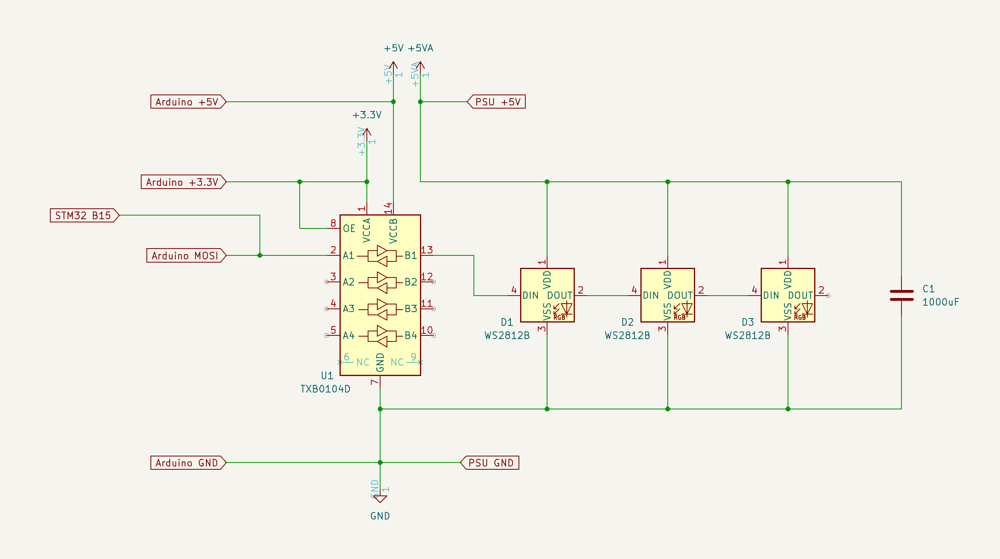

# Driving a NeoPixel LED strip on the STM32F746G-DISCO

Run a baremetal Swift program that drives a NeoPixel WS2812 LED strip from the STM32F746G-DISCO board's SPI peripheral, using DMA.

This example demonstrates how to reconfigure the STM32F7's PLL for a SPI clock rate that matches the WS2812 protocol's bit timing, then use the SPI2 peripheral together with DMA to shift out pixel data without blocking the CPU. It requires additional hardware beyond the discovery board: a 3.3V-to-5V level shifter (such as the TI TXB0104), a NeoPixel WS2812 or compatible LED strip, a breadboard, and a 5V power supply.


Connect the components as shown in this schematic. A capacitor across the LED strip's power supply is recommended:



The `Application` entry point reconfigures the PLL, enables the SPI2 and DMA1 peripherals, then drives an animated rainbow pattern across the strip using the `SPINeoPixel` driver:

```swift
import STM32F7X6
import Support

@main
public struct Application {
  public static func main() {
    // ... clock, PLL, and GPIO configuration ...

    print("Hello Swift!")
    var neoPixel = SPINeoPixel(dma: dma1, spi: spi2, pixelCount: 60)
    while true {
      neoPixel.rainbow()
      neoPixel.draw()
    }
  }
}
```

> Note: This is a baremetal example — there's no SDK or operating system involved. See <doc:Baremetal> for general guidance on baremetal Embedded Swift development. See <doc:Stm32BlinkGuide> for a simpler baremetal STM32F746G-DISCO example that only toggles a GPIO pin.

[View the example source on GitHub.](https://github.com/swiftlang/swift-embedded-examples/tree/main/stm32-neopixel)

## Install dependencies

Install the [`stlink`](https://github.com/stlink-org/stlink) command line tools, for example with `brew install stlink`.

## Install Swift

> Note: Embedded Swift is experimental. Public releases of Swift don't support Embedded Swift yet. See <doc:InstallEmbeddedSwift> for details.

Follow the instructions in <doc:InstallEmbeddedSwift> to install the latest Swift development snapshot with Embedded Swift support. Confirm the installation by running `swift --version` — it reports a "6.2-dev" or newer development snapshot.

## Build the project

Navigate to the example directory and build it:

```shell
$ cd stm32-neopixel
$ make
```

## Run on a device

Wire up the level shifter and LED strip according to the schematic above. Connect the STM32F746G-DISCO board to your Mac using the ST-LINK USB port. Flash the firmware:

```shell
$ st-flash --reset write .build/release/Application.bin 0x08000000
```

The LED strip lights up and slowly animates a color gradient.
